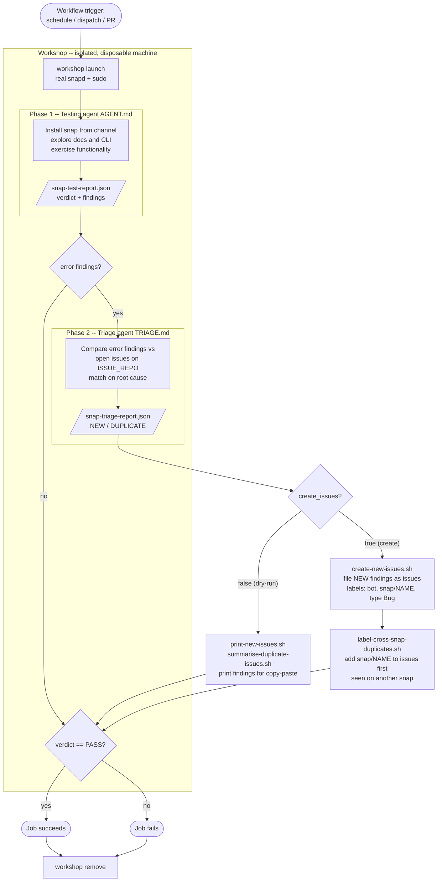

# Agentic Snap Test

An AI-driven end-to-end test for inference snaps. Instead of a fixed test script, an
LLM agent installs the snap the way a real user would, explores its documentation and
CLI, exercises its functionality, and writes a structured JSON report. A second agent
triages any defects it finds against the open issues on the tracker repo, and the
pipeline can then file new GitHub issues and label cross-snap duplicates automatically.

The whole flow runs inside a **workshop** — an isolated, disposable machine environment
that gives the agent a real `snapd` and passwordless `sudo`, so it can install and drive
the snap exactly as an end user would.

## Contents

| File | Role |
| --- | --- |
| `AGENT.md` | Prompt/instructions for the **testing** agent (phase 1). |
| `TRIAGE.md` | Prompt/instructions for the **triage** agent (phase 2). |
| `test.sh` | Phase 1 — launch the workshop, run the testing agent, write `snap-test-report.json`. |
| `triage.sh` | Phase 2 — run the triage agent, write `snap-triage-report.json`. |
| `summarise-duplicate-issues.sh` | Print duplicate findings and the issues they match. |
| `print-new-issues.sh` | Dry-run: print new findings for copy-paste. |
| `create-new-issues.sh` | Create mode: file new GitHub issues in the tracker repo. |
| `label-cross-snap-duplicates.sh` | Create mode: add this snap's label to shared cross-snap issues. |
| `local-run.sh` | Convenience wrapper that runs all phases locally. |

## Calling it from a workflow

In CI these phases are wired together by the **`agentic-test` composite action**, published
from the [`inference-snaps-dev`](https://github.com/canonical/inference-snaps-dev) repo. A
snap repo invokes it from a workflow such as `agentic-test.yaml` — you don't check anything
out, you just reference the action by tag.

The [smollm2-snap `agentic-test.yaml`](https://github.com/canonical/smollm2-snap/blob/main/.github/workflows/agentic-test.yaml)
workflow is the canonical example. See
[canonical/gemma4-snap#87](https://github.com/canonical/gemma4-snap/pull/87) for a
reference of adding this workflow to another snap.

The whole workflow is just a single step that calls the action:

```yaml
name: Agentic Snap Test

on:
  workflow_dispatch:

jobs:
  ai-test:
    runs-on: ubuntu-latest
    steps:
      - name: Run test
        uses: canonical/inference-snaps-dev/.github/actions/agentic-test
        with:
          snap-name: smollm2
          snap-channel: edge
          create-issues: false
          openrouter-api-key: ${{ secrets.OPENROUTER_API_KEY }}
          issue-create-token: ${{ secrets.ISSUE_CREATE_TOKEN }}
```

### Action inputs

| Input | Required | Default | Purpose |
| --- | --- | --- | --- |
| `snap-name` | yes | — | Snap to install and test. |
| `snap-channel` | no | `edge` | Store channel to install from (`track/risk/branch`). |
| `create-issues` | no | `false` | `true` files issues for NEW findings and labels cross-snap duplicates; `false` is a dry-run that only prints them. |
| `openrouter-api-key` | yes | — | OpenRouter API key used by both agents. |
| `issue-create-token` | only in create mode | — | Fine-grained PAT with Issues: read & write on the tracker repo (`canonical/inference-snaps`). |

> **Why a separate token?** Issues are filed in a *different* repo than the one running
> the workflow. The default `GITHUB_TOKEN` cannot write cross-repo, so a fine-grained PAT
> is required for `create-issues: true`. In dry-run mode it can be omitted.

Under the hood the action maps these inputs onto the environment variables the scripts
consume (`SNAP_NAME`, `SNAP_CHANNEL`, `CREATE_ISSUES`, `OPENROUTER_API_KEY`,
`ISSUE_CREATE_TOKEN`, plus `OPENROUTER_MODEL` and `ISSUE_REPO` defaults). The `verdict`
and `error_count` from the test report are exposed as step outputs (via `$GITHUB_OUTPUT`)
so the action can gate later steps and fail the job on a `FAIL` verdict.

## Running it locally

The agent needs a real machine to install the snap on. `local-run.sh` reproduces the
full CI flow (launch workshop → test → triage → issues → verdict gate → cleanup).

Prerequisites:

- [`workshop`](https://github.com/canonical/inference-snaps-dev) available on `PATH`.
- `opencode`, `jq`, and (for create mode) `gh` installed.
- An OpenRouter API key.

Run from this directory (`dev/tests/agentic`):

```bash
export OPENROUTER_API_KEY=sk-or-...
export SNAP_NAME=smollm2
export SNAP_CHANNEL=latest/edge

# Dry run: test, triage, and print any new/duplicate findings (no writes to GitHub).
./local-run.sh
```

To also file issues and label cross-snap duplicates, provide a token and enable create
mode:

```bash
export ISSUE_REPO=canonical/inference-snaps
export ISSUE_CREATE_TOKEN=github_pat_...   # Issues: read & write on ISSUE_REPO
export CREATE_ISSUES=true
./local-run.sh
```

You can also run the phases individually — e.g. `./test.sh` then `./triage.sh` — which
is handy when iterating on `AGENT.md` or `TRIAGE.md`. The workshop is launched
idempotently and reused across phases; `local-run.sh` removes it on exit.

Outputs written to this directory (git-ignored):

- `snap-test-report.json` — the testing agent's verdict, environment and findings.
- `snap-triage-report.json` — the triage agent's NEW/DUPLICATE classification.

## How the pipeline works

The pipeline runs in two agent phases followed by issue-management steps. Phase 2 and the
issue steps only run when the test report contains `severity: error` findings, and the
GitHub-writing steps only run in create mode.



### Stage by stage

1. **Create workshop.** `workshop launch` spins up an isolated, disposable machine with
   a working `snapd` and passwordless `sudo`. All agent work happens inside it, and it is
   removed when the run finishes (`workshop remove`).

2. **Testing** (`test.sh` + `AGENT.md`). The testing agent installs `$SNAP_NAME` from
   `$SNAP_CHANNEL` exactly as a user would (waiting for snapd, handling components and
   confinement), then explores the documentation and CLI and exercises the snap's
   functionality. It actively hunts for defects — a `PASS` is only valid if the snap
   genuinely works as documented. It writes `snap-test-report.json` with a `verdict`
   (`PASS`/`FAIL`) and a list of `findings`, each with a severity (`error`/`warning`/`info`).

3. **Triaging** (`triage.sh` + `TRIAGE.md`, only when there are `error` findings). The
   triage agent takes the error findings, collapses same-run duplicates by root cause,
   fetches the open issues on `$ISSUE_REPO`, and classifies each finding as **NEW** or
   **DUPLICATE** — matching on root cause rather than exact wording. It writes
   `snap-triage-report.json`, filling in a suggested title and body (from the tracker's
   bug-report template) for every finding.

4. **Issue creation and labelling.** In **dry-run mode** (`create_issues=false`),
   `summarise-duplicate-issues.sh` and `print-new-issues.sh` just print the results for a
   human to act on. In **create mode** (`create_issues=true`):
   - `create-new-issues.sh` files each NEW finding as an issue in `$ISSUE_REPO`, labelled
     `bot` and `snap/$SNAP_NAME` and typed `Bug`.
   - `label-cross-snap-duplicates.sh` finds DUPLICATE findings that match an issue first
     detected on a *different* snap and adds `snap/$SNAP_NAME` to it, so a single shared
     issue records every snap affected by the same bug.

5. **Verdict gate.** Finally the job fails if the test verdict was not `PASS`, and the
   workshop is removed regardless of the outcome.

